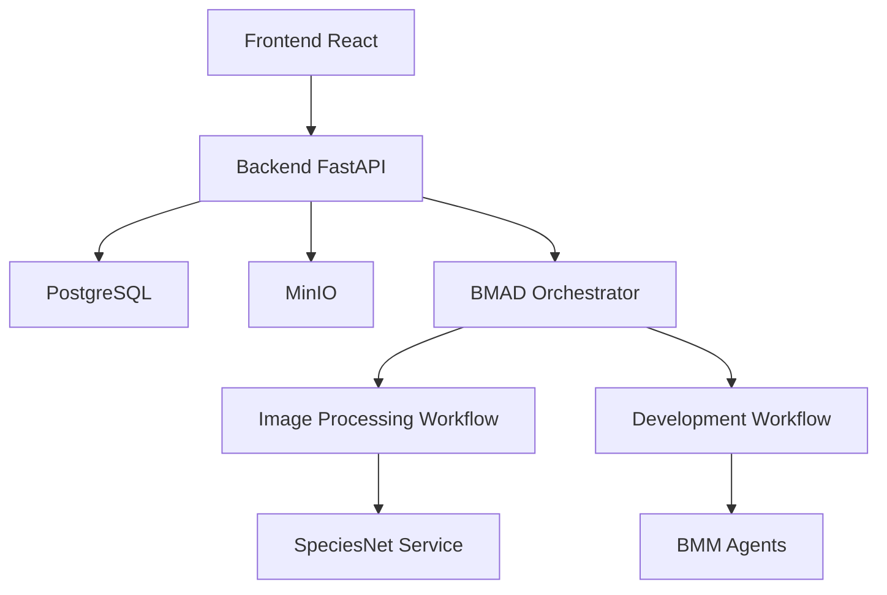
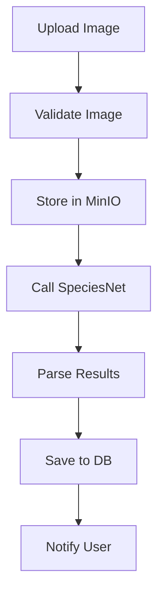

# Architecture Technique - Application de Détection d'Espèces

## Vue d'Ensemble

L'architecture de l'application Species_detection est conçue pour être modulaire, scalable et sécurisée, en s'appuyant sur le framework BMAD pour l'orchestration des workflows. Elle intègre des composants pour le traitement automatique d'images, la gestion des données et l'interface utilisateur, tout en respectant les exigences du PRD.

## Composants Architecturaux

### 1. Frontend
- **Description** : Interface web pour les utilisateurs finaux (chercheurs, agents de conservation, etc.)
- **Responsabilités** : Upload d'images, visualisation des résultats, gestion des projets, authentification
- **Technologies** : React.js avec TypeScript, HTML5 Canvas pour l'affichage d'images

### 2. Backend API
- **Description** : Couche API REST pour la logique métier
- **Responsabilités** : Authentification, gestion des projets/images, orchestration des workflows BMAD
- **Technologies** : Python FastAPI, SQLAlchemy pour ORM

### 3. Base de Données
- **Description** : Stockage des métadonnées
- **Responsabilités** : Utilisateurs, projets, images, résultats de détection
- **Technologies** : PostgreSQL

### 4. Stockage d'Objets
- **Description** : Stockage des fichiers binaires (images, résultats)
- **Responsabilités** : Persistance des images uploadées et des outputs de traitement
- **Technologies** : MinIO (compatible S3)

### 5. Service IA
- **Description** : Modèle de détection d'espèces
- **Responsabilités** : Analyse d'images pour identifier et localiser les espèces
- **Technologies** : SpeciesNet (modèle pré-entraîné), TensorFlow/PyTorch pour l'inférence

### 6. Framework BMAD
- **Description** : Orchestrateur de workflows et agents
- **Responsabilités** : Gestion des workflows de traitement d'images et de développement
- **Modules utilisés** : Core, BMB (pour agents), BMM (pour gestion de projet)

## Intégration du Framework BMAD

BMAD est intégré comme couche d'orchestration pour automatiser les processus complexes :

### Workflows de Traitement d'Images
Workflow "Image Processing" avec les étapes suivantes :
1. **Validation** : Agent de validation des images (format, taille, métadonnées)
2. **Stockage** : Agent de persistance dans MinIO
3. **IA Processing** : Agent d'appel au service SpeciesNet
4. **Parsing** : Agent d'extraction des résultats (bounding boxes, scores)
5. **Persistence** : Agent de sauvegarde des résultats en base
6. **Notification** : Agent d'envoi de notifications à l'utilisateur

### Workflows de Développement
Utilisation des agents BMM pour la gestion du cycle de développement :
- **BMM-Architect** : Conception d'architecture
- **BMM-Dev** : Implémentation de code
- **BMM-PM** : Gestion de projet
- **BMM-QA** : Tests et qualité
- **BMM-UX-Designer** : Design d'interface

## Technologies et Outils

| Composant | Technologie | Version | Justification |
|-----------|-------------|---------|---------------|
| Frontend | React.js | 18.x | Framework moderne pour SPAs, écosystème riche |
| Backend | FastAPI | 0.100+ | Performance élevée, auto-documentation, async |
| Base de données | PostgreSQL | 15.x | ACID, extensions spatiales pour GPS |
| Stockage | MinIO | Latest | Compatible S3, scalable |
| IA | SpeciesNet | - | Spécialisé pour la détection d'espèces |
| Orchestration | BMAD | 6.0.0-alpha.23 | Framework intégré pour workflows |
| Conteneurisation | Docker | 24.x | Portabilité et déploiement |
| CI/CD | GitHub Actions | - | Automatisation des déploiements |

## Diagrammes d'Architecture

### Diagramme de Composants

### Workflow de Traitement d'Images

## Interfaces et APIs

### API Principales
- **Authentification** : `/auth/login`, `/auth/register` (JWT)
- **Projets** : `/projects/` (CRUD)
- **Images** : `/images/upload`, `/images/` (liste), `/images/{id}` (détail)
- **Workflows BMAD** : `/workflows/trigger` (déclenchement), `/workflows/status` (suivi)

### Intégrations Externes
- **SpeciesNet** : API REST ou gRPC pour l'inférence
- **BMAD** : Interface Python pour l'orchestration

## Considérations de Sécurité et Conformité

### Sécurité
- **Authentification** : OAuth 2.0 / JWT
- **Autorisation** : RBAC (viewer, editor, admin)
- **Chiffrement** : TLS 1.3 pour les communications, AES pour le stockage
- **Validation** : Sanitisation des inputs, limites de taux

### Conformité
- **RGPD** : Gestion des données personnelles, droit à l'oubli
- **Accessibilité** : WCAG 2.1 AA
- **Audit** : Logs détaillés pour traçabilité

## Considérations de Performance et Scalabilité

- **Mise en cache** : Redis pour les sessions et résultats fréquents
- **Asynchrone** : Traitement en arrière-plan avec Celery
- **Scalabilité** : Kubernetes pour l'orchestration de conteneurs
- **Monitoring** : Prometheus + Grafana pour métriques

## Déploiement

- **Environnement** : Docker Compose pour développement, Kubernetes pour production
- **Cloud** : AWS/GCP/Azure avec services managés (RDS, S3, etc.)
- **CI/CD** : Pipelines automatisés pour tests et déploiements

Cette architecture assure une séparation claire des préoccupations, une maintenabilité élevée et une évolutivité pour les futures fonctionnalités comme l'analyse avancée ou l'intégration mobile.