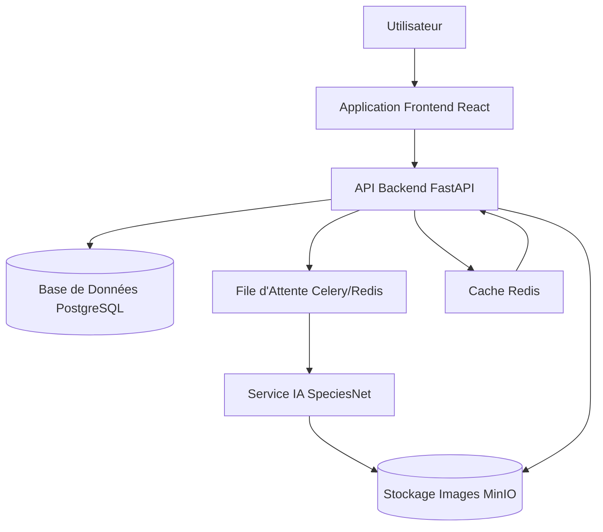

# Architecture Système Complète - Application de Détection d'Espèces

## Vue d'Ensemble
L'architecture système de l'application de détection d'espèces est conçue pour être scalable, sécurisée et performante, en se basant sur les exigences du PRD et les designs UX. Elle suit une approche microservices avec séparation des préoccupations pour faciliter la maintenance et l'évolutivité.

## Composants Système Principaux

### 1. Application Frontend
- **Technologie** : React.js avec TypeScript
- **Responsabilités** : Interface utilisateur pour dashboard, upload, galerie, visionneuse d'images, rapports
- **Architecture** : Composants modulaires avec React Router pour la navigation, Context API pour la gestion d'état

### 2. API Backend
- **Technologie** : Python FastAPI
- **Responsabilités** : Gestion des requêtes HTTP, logique métier, orchestration des services
- **Architecture** : Architecture en couches (Contrôleurs, Services, Répositories)

### 3. Service d'Inférence IA
- **Technologie** : Python avec PyTorch
- **Responsabilités** : Exécution du modèle SpeciesNet pour la détection d'espèces
- **Architecture** : Microservice indépendant pour l'isolation et la scalabilité

### 4. Base de Données
- **Technologie** : PostgreSQL
- **Responsabilités** : Stockage des métadonnées (utilisateurs, projets, détections)
- **Architecture** : Schéma relationnel avec SQLAlchemy pour l'ORM

### 5. Stockage de Fichiers
- **Technologie** : MinIO (S3-compatible)
- **Responsabilités** : Stockage persistant des images
- **Architecture** : Buckets organisés par projets

### 6. File d'Attente et Cache
- **Technologie** : Redis pour cache et Celery pour files d'attente
- **Responsabilités** : Traitement asynchrone, mise en cache des réponses

## Technologies Choisies
- **Frontend** : React.js, TypeScript, HTML5 Canvas
- **Backend** : Python FastAPI, SQLAlchemy
- **IA** : PyTorch pour SpeciesNet
- **Base de Données** : PostgreSQL
- **Stockage** : MinIO
- **File d'Attente** : Celery avec Redis
- **Cache** : Redis
- **Déploiement** : Docker, Kubernetes
- **Monitoring** : Prometheus, Grafana

## Diagramme d'Architecture de Haut Niveau

## Architecture Détaillée des Composants

### Frontend
- **Composants UI** : Dashboard, UploadForm, Gallery, ImageViewer, Reports
- **Gestion d'État** : Context API pour l'état global, local state pour composants
- **Navigation** : React Router avec breadcrumbs
- **Feedback** : Toasts, modals, spinners

### Backend
- **Couche Présentation** : Endpoints REST avec FastAPI
- **Couche Métier** : Services pour logique (upload, détection, rapports)
- **Couche Données** : Repositories pour accès DB
- **Authentification** : JWT tokens, middleware d'autorisation

### Service IA
- **Entrée** : URL d'image depuis stockage
- **Traitement** : Prétraitement, inférence SpeciesNet, post-traitement
- **Sortie** : JSON avec détections (espèces, boîtes, scores)

### Base de Données
- **Tables** : users, projects, images, detections, annotations
- **Relations** : Clés étrangères pour intégrité

## Patterns de Conception
- **Architecture en Couches** : Séparation présentation/métier/données
- **Repository Pattern** : Abstraction de l'accès aux données
- **Dependency Injection** : Pour testabilité et modularité
- **Factory Pattern** : Pour instanciation des modèles IA
- **Observer Pattern** : Pour notifications temps réel (WebSocket)
- **Strategy Pattern** : Pour différents algorithmes de détection

## Considérations de Sécurité
- **Authentification** : JWT avec refresh tokens, OAuth optionnel
- **Autorisation** : RBAC (viewer, editor, admin)
- **Protection des Données** : Chiffrement en transit (HTTPS), en repos (AES-256)
- **Conformité RGPD** : Minimisation des données, consentement, droit à l'oubli
- **Sécurité API** : Rate limiting, validation d'entrée, CORS
- **Sécurité Stockage** : Accès signé aux URLs, chiffrement des images sensibles

## Considérations de Performance
- **Mise en Cache** : Redis pour réponses API, thumbnails d'images
- **Traitement Asynchrone** : Files d'attente pour inférence IA
- **Scalabilité** : Kubernetes pour scaling horizontal, load balancing
- **Optimisation** : Compression d'images, lazy loading, CDN
- **Monitoring** : Métriques temps de réponse, débit, utilisation ressources
- **Seuils** : Upload < 10s, détection < 30s/image, chargement page < 3s

Cette architecture assure une plateforme robuste pour la détection d'espèces, alignée sur les besoins des utilisateurs et les contraintes techniques identifiées.