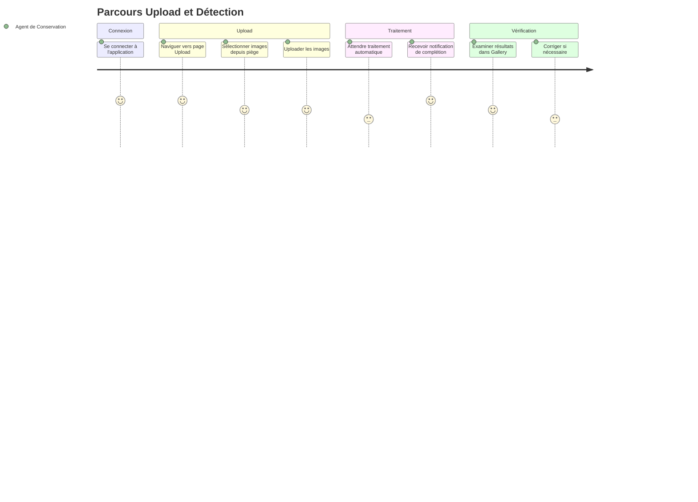
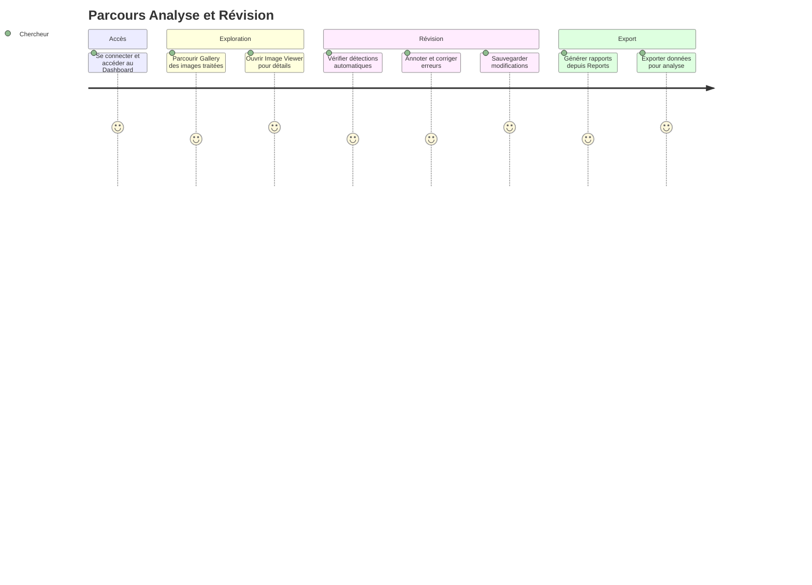
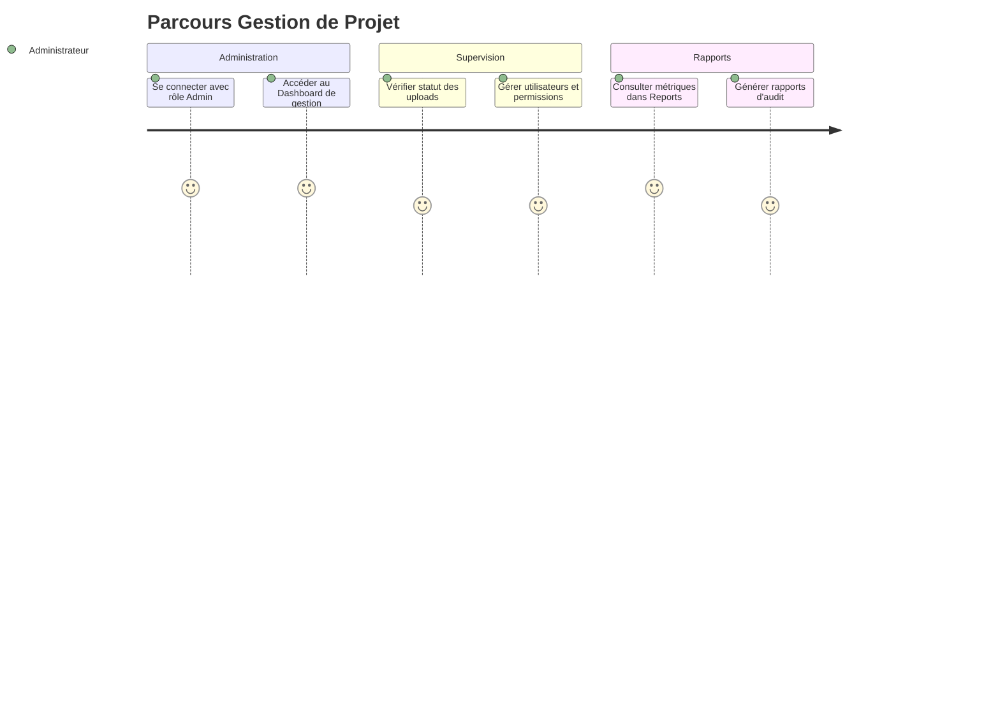

# Parcours Utilisateurs - Application de Détection d'Espèces

## Vue d'Ensemble
Basé sur les personas et scénarios du PRD, voici les parcours utilisateurs principaux pour l'application.

## Parcours 1: Upload et Détection Automatique (Agent de Conservation)


## Parcours 2: Analyse et Révision (Chercheur en Biodiversité)


## Parcours 3: Gestion de Projet (Administrateur)


## Parcours 4: Apprentissage (Étudiant)
```mermaid
journey
    title Parcours Apprentissage
    section Découverte
        Se connecter et explorer Dashboard: 5: Étudiant
        Suivre tutoriels intégrés: 4: Étudiant
    section Interaction
        Tester upload d'images simples: 4: Étudiant
        Observer détections dans Gallery: 5: Étudiant
        Utiliser Image Viewer pour comprendre: 4: Étudiant
    section Apprentissage
        Lire explications sur les espèces: 5: Étudiant
        Accéder à visualisations simples: 4: Étudiant